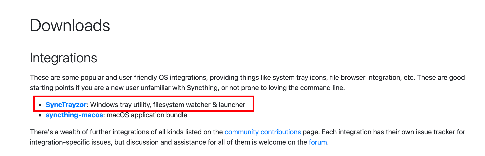
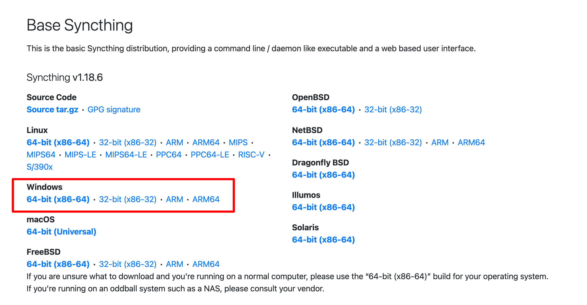
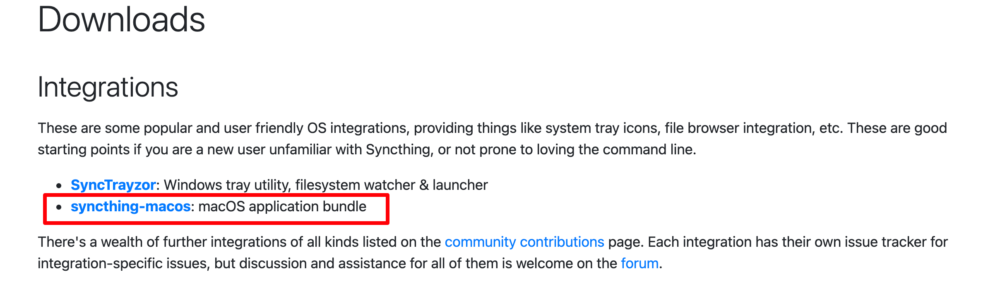
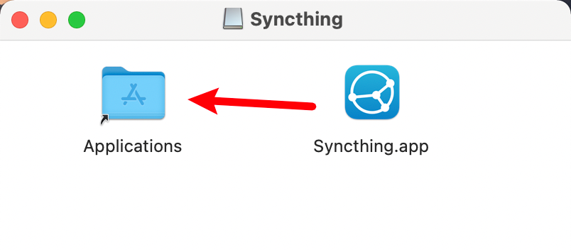
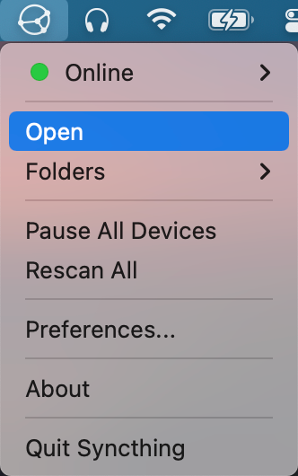

&nbsp;&nbsp;&nbsp;&nbsp;&nbsp;&nbsp;&nbsp;&nbsp;随着数据的增长，我们对于文件的同步和备份需求也日趋强烈。各种网盘为我们在文件同步备份提供便利的同时，也在速度、安全和隐私等方面带来不小的限制和风险。今天给大家介绍一款新的文件同步工具---Synchting。
<!-- more -->

#  Syncthing-P2P文件同步工具的使用

## 1. Syncthing简介

[Syncthing](https://syncthing.net/)是一款开源免费跨平台的文件同步工具，是基于**P2P技术**实现设备间的文件同步，所以它的同步是**去中心化**的，即你并不需要一个服务器，故不需要担心这个中心的服务器给你带来的种种限制，而且类似于torrent协议，参与同步的设备越多，同步的速度越快。针对**隐私**问题，Syncthing软件只会将数据存储于个人信任的设备上，不会存储到服务器上。设备之间的通信均通过TLS进行，Syncthing还使用了完全正向保密技术来进一步保障你的数据安全。对于处于**不同局域网之中**的设备之间的文件同步，Syncthing也提供了支持。

Syncthing支持非常多的平台，包括**Windwos、macOS、Android、Linux、FreeBSD、Solaris、群晖和威联通NAS**等，但遗憾的是，在iOS上只有一个第三方客户端fsync。

## 2. 基本使用

### 2.1 安装Syncthing

#### 2.1.1 Windows安装

1. **有界面安装**

进入[官网下载地址](https://syncthing.net/downloads/)找到Windows版本的，这个是带图像用户界面的并且可以最小化到托盘后台运行。点击进去，下载`.exe`文件，下载完成之后双击运行即可。



2. **无界面安装**

在下载页下拉，找到下面这个Windows版本，这个是没有图形用户界面的。下载下来是一个压缩包，解压出来之后，打开这个文件夹，双击文件夹里`syncthing.exe`就能启动，启动时会打开一个终端，这个终端不能关闭，关闭之后服务器就关闭了。启动成功之后会自动打开浏览器到用户界面。



#### 2.1.2 Mac安装

进入[官网下载地址](https://syncthing.net/downloads/)找到MacOS版本的，点击进去，下载`.dmg`格式。



下载完成之后，双击下载下来的文件，将syncthing拖入到Application文件夹即可。



启动之后可以在桌面顶部菜单栏查看到，点击`Open`就能打开浏览器访问页面。




#### 2.1.3 Linux安装

我这里使用的是**Ubuntu 18.04**系统，安装方式使用的是`apt-get`。

```shell
# 更新软件源
apt-get update
# 安装Syncthing
sudo apt-get install syncthing
# 安装完成后检查版本
syncthing -version
```

现在已经安装了Syncthing，由于Ubuntu 18.04是systemd兼容的，我们可以创建systemd单元文件来管理syncthing服务，systemd的服务文件由Syncthing提供。

```shell
# 创建文件
sudo vim /etc/systemd/system/syncthing@root.service

# 写入下面内容，将下面127.0.0.1地址替换成你自己服务器的IP地址，如果还是无法方法，就把下面ip改成0.0.0.0
[Unit]
Description=Syncthing - Open Source Continuous File Synchronization for %I
Documentation=man:syncthing(1)
After=network.target
[Service]
User=%i
ExecStart=/usr/bin/syncthing -no-browser -gui-address="127.0.0.1:8384" -no-restart -logflags=0
Restart=on-failure
SuccessExitStatus=3 4
RestartForceExitStatus=3 4
[Install]
WantedBy=multi-user.target

# 更新systemctl服务列表
sudo systemctl daemon-reload

# 重新启动syncthing服务
sudo systemctl start syncthing@root
```


